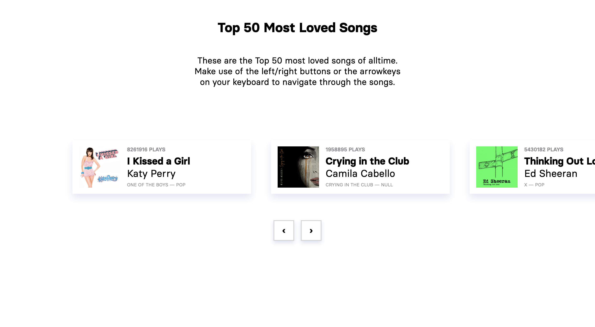

# Frontend voor Designers - opdracht 3: Een interactie uitwerken met externe data

Voor deze opdracht ga ik een functionaliteit ontwerpen met externe data. De data is JSON die met een [REST API](https://developer.mozilla.org/en-US/docs/Glossary/REST) van een externe bron wordt ingeladen met Javascript.  Als de data geladen is moeten gebruikers mijn ontwerp op verschillende manieren kunnen bedienen. Verschillende states zijn vormgeven en worden op het juiste moment getoond.

Lees hier de [opdrachtbeschrijving](./opdrachtbeschrijving.md).



# Top 50 Most Loved Songs
Voor dit project heb ik een pagina gecodeerd waarop de Top 50 Most Loved Songs te bekijken zijn in een vorm van een carousel.
De carousel is navigeerbaar met behulp van de links/rechts knoppen onder de liedjes en ook via de links/rechts – W/D knoppen op het toetsenbord.

De data die ik voor dit project heb gebruikt, is te vinden in [dit JSON file](https://www.theaudiodb.com/api/v1/json/5d656564694f534d656564/mostloved.php?format=track&format=track).

Bekijk hier [mijn uitgewerkte opdracht](https://mggchn.github.io/frontend_for_designers1920/assignments_lessons/opdracht3/).

## Principles of User Interface Design
In mijn ontwerp heb ik interface design principles 04, 08, 09 & 11 van [Principles of User Interface Design](http://bokardo.com/principles-of-user-interface-design/) toegepast. Deze zijn hieronder toegelicht:

### 04. Keep users in control
Dit principle is binnen mijn ontwerp terug te vinden bij de twee buttons, met elk een pijl op de button aangegeven die naar links of rechts wijst. Deze geven duidelijk aan wat er zal gaan gebeuren als er op de button gedrukt wordt, namelijk het naar links of rechts navigeren.

### 08. Provide a natural next step
Dit principle is binnen mijn ontwerp te vinden bij de carousel. De liedjes aan de buitenkant worden niet volledig weergegeven in de slider, wat betekent dat er nog iets achter zit. De gebruiker zal dit ook verwachten en zal dus m.b.v. de buttons of de toetsen navigeren, zodat de liedjes volledig in beeld te zien zijn.
Op de buttons zijn er een hoverstate aanwezig. Dit laat een sein bij de gebruiker achter dat deze buttons klikbaar zijn.

### 09. Appearance follows behavior
Dit principle is binnen mijn ontwerp verwerkt door de buttons er ook klikbaar uit te laten zien. Dit is toegepast door een schaduw toe te voegen en een randje toe te voegen aan de knop om het als een blokje uit te laten zien.

### 11. Strong visual hierarchies work best
De visuele hiërarchie is binnen mijn ontwerp terug te zien binnen de teksten op de pagina. De headings zijn groter dan de broodtekst en dikgedrukt. Voor de broodtekst is er in het algemeen sprake van een reguliere font-weight, maar voor sommige stukken tekst is dit een uitzondering. Voor het x aantal plays dat wordt laten zien bij elk lied is deze bijvoorbeeld grijs gemaakt en is deze in hoofdletters weergegeven, zodat er extra contrast met de rest van de tekst zit. 

## States
In mijn ontwerp heb ik de verschillende states van de [UI stack](https://www.scotthurff.com/posts/why-your-user-interface-is-awkward-youre-ignoring-the-ui-stack/) toegepast. Deze zijn hieronder toegelicht:

### Blank state
De Blank State zit – naar mijn mening – er niet in. Dit zou ik willen proberen bij de herkansing wel erin te krijgen.

### Loading State
De Loading State zit er niet in. Dit zou ik willen proberen bij de herkansing wel erin te krijgen.

### Empty State 
De Empty State is toegepast door de tekst die beschrijft hoe de carousel in zijn werking gaat. Daarnaast geven de buttons met de pijlen onder de slider ook aan wat het doet als je erop zou klikken.

### Ideal State
De Ideal State is bereikt wanneer de gebruiker succesvol door de liedjes kan navigeren d.m.v. de buttons.

## Code
### Javascript
Voor deze opdracht was het de bedoeling dat je data uit een JSON file haalt in Javascript en deze weergeeft op je eigen HTML pagina. Daarna kan je met die aangeroepen data interactie toevoegen door eventListeners te gebruiken. Dit ging als volgt:

1. Data laden d.m.v. XMLHttpRequest.
```javascript
let requestURL = 'https://raw.githubusercontent.com/mggchn/frontend_for_designers1920/master/assignments_lessons/opdracht3/mostlovedsongs.json';
let request = new XMLHttpRequest();
request.open('GET', requestURL);
request.responseType = 'json';
request.send();
request.onload = function () {
	const songs = request.response;
	// console.log(songs);
	showSongs(songs);
}
```

2. Functie aanmaken met daarin een `for` loop om de gewenste JSON data aan te kunnen roepen.
```javascript
function showSongs(jsonObj) {
    var details = jsonObj.loved;

    for (let i = 0; i < details.length; i++) {
        
    }
}
```

3. Elementen aanmaken die in de function worden gestopt. En een class aanmaken om deze te stijlen.
```javascript
const myCarouselContainer = document.createElement('div');
myCarouselContainer.classList.add('carousel-container');
```

4. In de `for` loop de gewenste data uit de JSON file aanroepen en appenden.
```javascript
const myArticle = document.createElement('article');
myCarouselSlider.appendChild(myArticle);
```
---

5. Functie voor de linker- en rechter button aanmaken: `.onclick`
```javascript
previousButton.onclick = function () {
	position = (position > 0) ? position - 1 : 0;
    divSongs.style.transform = 'translate(calc(' + (position) * -50 + '%)';
}

nextButton.onclick = function () {
	position = (position < 40) ? position + 1 : 40;
	divSongs.style.transform = 'translate(calc(' + (position) * -50 + '%)';
}
```

6. Functie aanmaken om de button te bedienen met het toetsenbord: `keydown`
```javascript
document.addEventListener('keydown', controls);

// Met 37 of 'W' (pijltje links) ga je naar links.
// Met 39 of 'D' (pijltje rechts) ga je naar rechts.
function controls(e) {
	// console.log(e.which);
	if (e.which === 37 || e.which === 65) {
		previousButton.onclick();
	} else if (e.which === 39 || e.which === 68) {
		nextButton.onclick();
	}
```

En voilà! Het project is nu gereed om te bekijken en te gebruiken :+1:.

## Bericht aan Koop
Tijdens de eindbeoordeling hebben we kort besproken dat mijn ontwerp wel aan de minimale eisen voldoet, maar dat er nog altijd ruimte is om de opdracht nòg beter te maken – states. Dit ben ik ook bereid om te proberen, dus hieronder een aantal vragen:

1. Voor de Blank State: ik heb de pagina eigenlijk als een Ideal State gemaakt. Hoe zou ik dan de Blank State moeten maken? Moet ik daarvoor `element.classList.add()` en `element.classList.remove()` gebruiken?  
2. Heb je eventueel nog inspiratie voor een Blank State die ik kan verwerken in mijn ontwerp?

Ongeacht het thuiswerken, vond ik dat de manier van lesgeven super soepel en fijn verliep. Bedankt voor de hulp en lessen! :simple_smile: :sparkles: